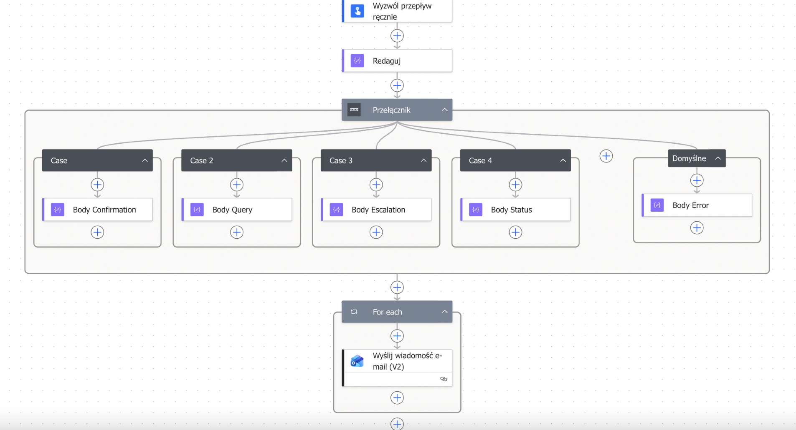
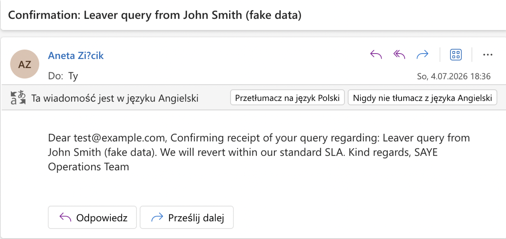
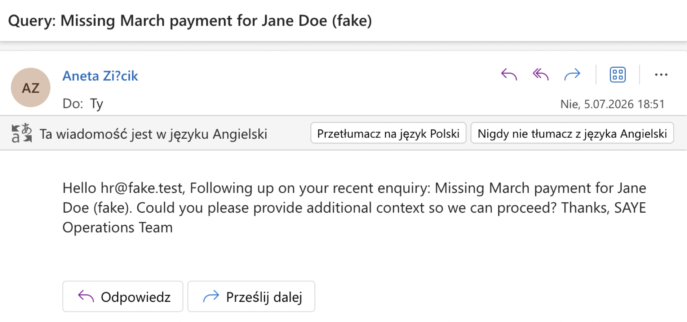
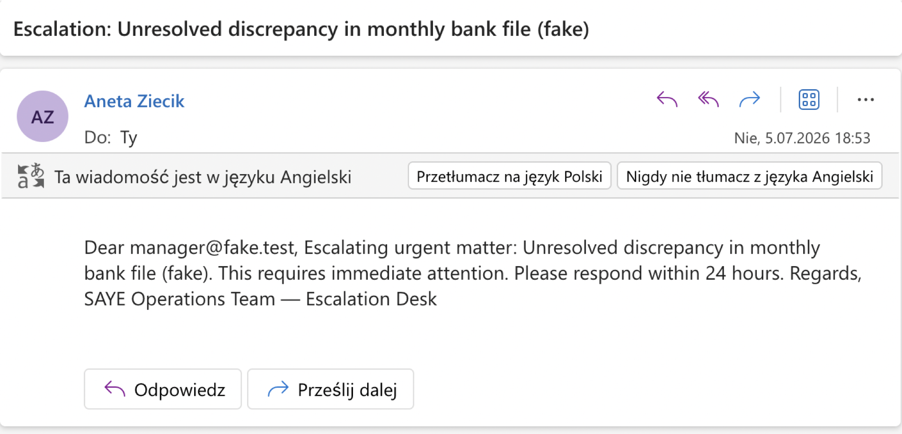
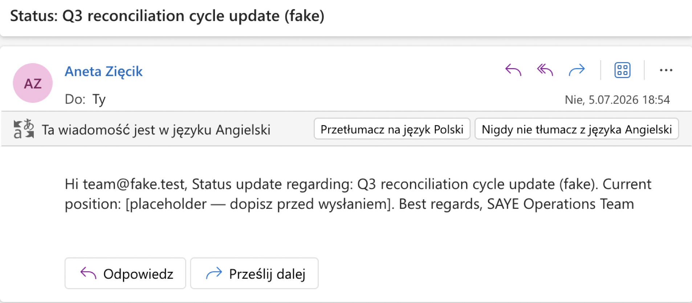
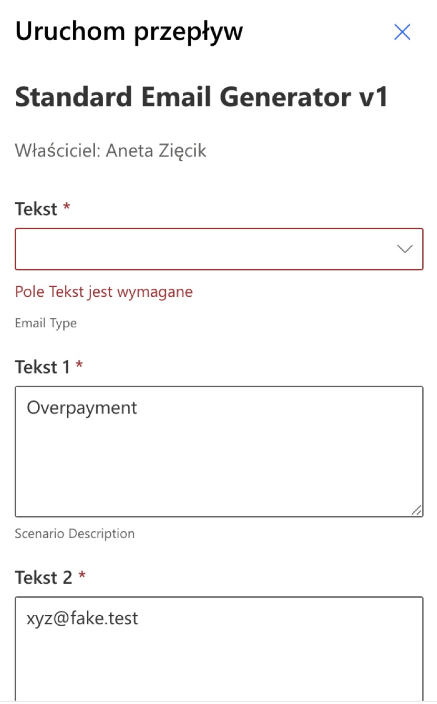

# Standard Email Generator

A Power Automate flow that automates repetitive operational email drafting for back-office teams.

> ⚠️ **Note on data**: All examples, screenshots, recipient addresses, and test scenarios in this repository use **fake/synthetic data**. No real client, employee, or operational information is included at any stage.

---

## Problem

In back-office operations, approximately 30% of daily emails follow four repetitive patterns: **confirmation receipts, status enquiries, escalations, and query responses**. Each takes 2–3 minutes to write manually. For a full-time operations specialist, that's roughly **60 minutes per day** spent on templated writing that adds no analytical value.

This flow automates the drafting phase. The user specifies **what** and **to whom** through four input parameters — the flow assembles the appropriate template and delivers it as a ready email.

---

## Architecture



The flow consists of four main stages:

**1. Manual trigger** with 4 input parameters:
- `Email Type` (choice: Confirmation / Query / Escalation / Status)
- `Scenario Description` (text)
- `Recipient Email` (text)
- `Tone` (choice: Formal / Neutral / Friendly)

**2. Compose action** that structures input data for reuse downstream.

**3. Switch action** on `Email Type` — the decision center of the flow:
- Four Cases, one per email type, each containing a `Compose` action with the appropriate template
- Default case with an error message — defensive fallback for future input changes

**4. Outlook.com — Send email (V2)** with:
- `Body` assembled via `coalesce()` expression that picks the output of the executed Case
- `Subject` combining hardcoded prefix + dynamic scenario description

---

## Key expressions used

**Switch value handling** — converts multi-select array output into a plain string that Switch can compare against Case values:

```
first(triggerBody()?['text'])
```

**Body assembly** — picks the non-null output from whichever Case was executed by the Switch:

```
coalesce(
  outputs('Body_Confirmation'),
  outputs('Body_Query'),
  outputs('Body_Escalation'),
  outputs('Body_Status'),
  outputs('Body_Error')
)
```

Since a Switch executes exactly one Case per run, only one of the five `Compose` blocks produces output — the rest return `null`. `coalesce` returns the first non-null value, which is always the body from the executed Case.

---

## Test results

The flow was tested against all four email types using **synthetic scenarios and fictional recipient addresses**. Each test produced a correctly formatted email with dynamically inserted recipient and scenario data:

    (

Example test inputs (all fictional):
- `Confirmation` → "Customer query for John Smith (fake)" → `client@fake.test`
- `Query` → "Missing March payment for Jane Doe (fake)" → `hr@fake.test`
- `Escalation` → "Unresolved discrepancy in monthly report (fake)" → `manager@fake.test`
- `Status` → "Q3 reconciliation cycle update (fake)" → `team@fake.test`

The Default case is not reachable through normal UI use (the Email Type dropdown enforces valid selection) but remains in place as a safety net for future changes to input options.

---

## Compliance note

Built and tested in a **private Microsoft tenant on synthetic data**. No real client, employee, or operational information from any employer was used at any stage. All recipient addresses and scenarios are **entirely fictional** and clearly marked as such throughout the repository (e.g. `client@fake.test`, scenarios suffixed with `(fake)`).

The flow uses only Standard connectors (Outlook.com); no data leaves the private tenant environment.

---

## Tech stack

- **Power Automate** — Instant cloud flow
- **Outlook.com connector** (Standard tier)
- **Workflow Definition Language expressions** — `coalesce`, `first`, `triggerBody`, `outputs`

---

## Context

This project covers Power Automate fundamentals: triggers, actions, connectors, switch/branching logic, dynamic content, and Workflow Definition Language expressions.

---

**Author**: Aneta Zięcik  
**Built**: July 2026  
**Status**: v1 — functional, tested, ready for AI iteration
